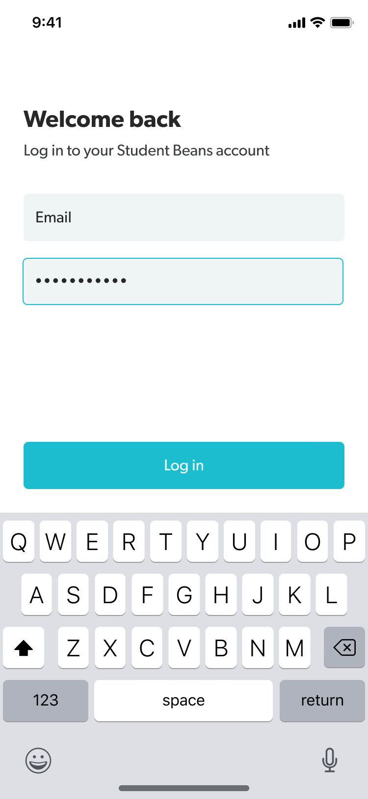
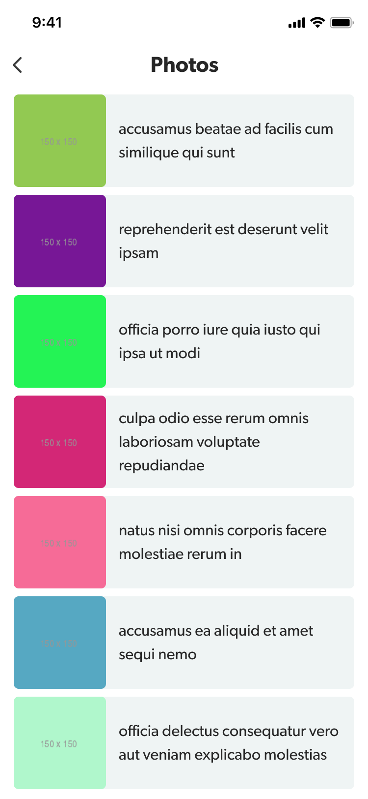

# An Android Interview test project

## Overview
- Built with: 
    - livedata 
    - rxjava
    - retrofit, 
    - navigation graph
    - koin DI
    - mockito for testing
    - android view binding
- Architecture is MVVM with repo's and data source

# Original Spec
## Designs

 

## Instructions

Complete this app recreating the designs above, and focus on the following:

 - Focus on best practices.
 - You can use any architecture pattern but MVVM is preferred
 - Extra point for the usage of jetpack libraries and tests
 
 # The screens
 - Login: On tapping "Log in", validate the fields aren't empty and show the Photos screen
 - Photos: On the Photos screen, show a list of images from this API: https://jsonplaceholder.typicode.com/photos (show the image from `thumbnailUrl` and the `title`)

 Show us your best code!
